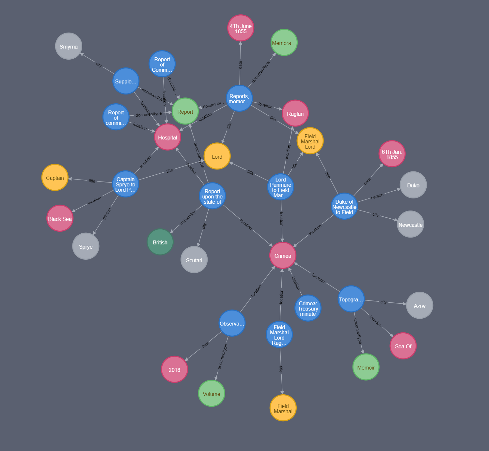

# tna-prototype

## Prerequisites 

Download the stanford core NLP models from [https://github.com/hippo-digital/tna-prototype/releases/tag/0.1-nlp](https://github.com/hippo-digital/tna-prototype/releases/tag/0.1-nlp) and unzip the multipart zip into the `FeatureExtractor` project directory.

## Running Neo4J

The solution assumes NEO4J is running in a docker container on the local machine. To create a neo4j docker instance run 

    docker pull neo4j 
    
    docker run --publish=7474:7474 --publish=7687:7687 --volume=$HOME/neo4j/data:/data neo4j
    
Once the container is up and running you should be able to navigate to `localhost:7474` and see the Neo4J admin console. 

## Running the application

Open the solution file in Visual Studio / JetBrains Rider and run the `GraphBuilder` project. This will build a graph based on the `C14242` series. 

Once the load has finished you can now navigate to the Neo4j console and run a query to see a graph for example, 

    MATCH p=(n:location)-[:title|:nationality|:city|:person|:documenttype|:date|:location*0..2]-(a) WHERE n.name = "Crimea" or n.name="Hospital" RETURN DISTINCT n, collect(a)[..25]
    
should return something like 

    
**Optional**

You can also run the `FeatureExtractor` project. This will output a set of JSON files to the `processed` folder in the root directory of this project. The `GraphBuilder` project will then read all of the files into the `processed` folder load all of the results to the Neo4J instance.
